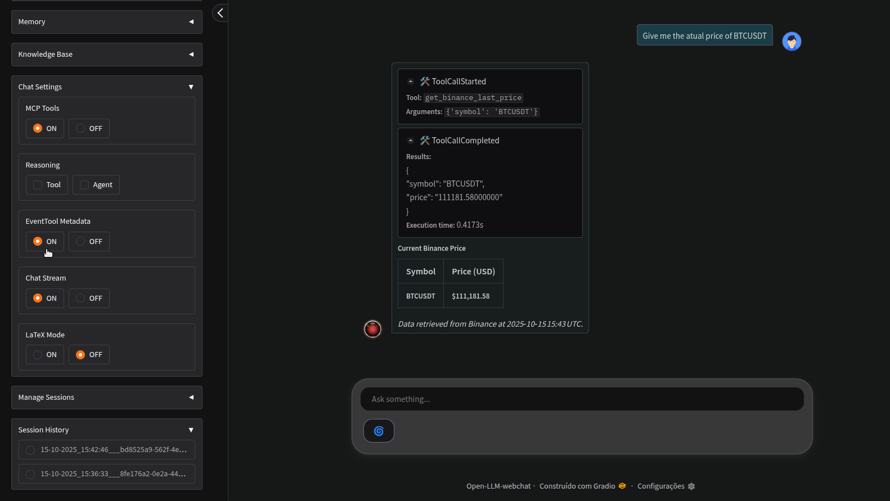

<br/>

# Open-LLM-webchat

<br/>

A open source webchat app for integrate LLMs in a nice visual application, built on the powerful Gradio web interface and Agno a high-performance SDK and runtime for multi-agent systems.

**Open-LLM-webchat** is an open source webchat project designed to provide a versatile and powerful web interface for integration with local and proprietary LLMs and custom agent systems. Developed in Python, its goal is to facilitate both the rapid prototyping of ideas and the development of custom webchats, fully integrated with intelligent agent architectures. Combining the best of the Gradio libraries — which offers an elegant and intuitive web interface — and Agno — a high-performance SDK and runtime for multi-agent systems — the project aims to unite simplicity, flexibility, and performance in a single solution.

<h3 align="center">
  
</h3>

<br/>

## Features

- Support for proprietary and open LLMs models
- Support for local LLMs models (Ollama)
- User authentication control
- Integrated PDF knowledge base for RAGs
- MCP tools Integration
- Short-term and long-term memory
- Reasoning control
- Complete control of user sessions
- Light and dark theme settings
- Organized Python code for personal customizations
- Isolated deployment with Docker

<br/>

## Prerequisites

- [Docker](https://docs.docker.com/get-docker/)
- [Docker Compose](https://docs.docker.com/compose/install/)
- [Git](https://git-scm.com/book/en/v2/Getting-Started-Installing-Git)
- [Poetry](https://python-poetry.org/)

<br/>

## Get Started

#### Local Instalation via Docker (Recommended):

- Download the repository

```
git clone https://github.com/fab2112/Open-LLM-webchat.git
cd Open-LLM-webchat
```

- Set the **.env** file with keys necessary based in custom settings
- Build docker services

```
docker-compose up --build -d
```

#### Local Instalation via Poetry:

```
git clone https://github.com/fab2112/Open-LLM-webchat.git
cd Open-LLM-webchat
```

```
poetry env use python3.12
poetry install
poetry shell

cd src/
python app.py 
```

<br/>

## Usage

- After building, access the application in the browser at [http://0.0.0.0:7860](http://0.0.0.0:7860)
- Login with username and password defined in **settings.py**

<br/>

## Custom Settings

- Access custom settings via the **settings.py** file for change defaut before building

| Variable       | Details                                         |
| :------------- | :---------------------------------------------- |
| USERS          | Set users authentication login                  |
| OLLAMA_URL     | Ollama internal Docker url                      |
| STREAM_DELAY   | Ratelimit of stream chunks per seconds          |
| DB_FILE        | Path of main SQLite data base                   |
| MODELS         | LLM models                                      |
| SHORT_MEM_RUNS | Session runs for short-term memory              |
| DEBUG_MODE     | Set agent to verbose mode                       |
| MAX_TOKEN      | Maximum number of tokens generated by the model |

<br/>

## MCPs configurations

- Set MCPs servers parameters in json file **mcps_config.json** as example below
- The MCPs servers (Docker | NPM packages) will be installed on the first tool call.

```
{

    "time": {
        "command": "docker",
        "args": [
            "run",
            "-i",
            "--rm",
            "mcp/time"
        ]
    },

    "tavily-mcp": {
        "command": "npx",
        "args": [
            "-y",
            "tavily-mcp@0.1.2"
        ],
        "env": {
            "TAVILY_API_KEY": "...Tavily api-key here..."
        }
    }

}
```

## Local Ollama Settings

- Making the service accessible through Docker
- Add the following line under the [Service] section in "/etc/systemd/system/ollama.service"

```
Environment="OLLAMA_HOST=0.0.0.0"
```

- Save, exit, reload the systemd configuration and restart Ollama

```
systemctl daemon-reload
systemctl restart ollama
```

- Load the desired models in local host
- Search for the best model that suits you [https://ollama.com/](https://ollama.com/)
- Define the Ollama model in **settings.py** and building the application again

<br/>

## Ecosystem

- Infrastructure

| Components      | Version |
| --------------- | ------- |
| Docker Engine   | 28.1.1  |
| Docker Compose  | 2.34.0  |
| Ollama          | 0.6.3   |
| Poetry          | 2.1.1   |

<br/>

## Screenshot

<br/>

- knowledge base (RAG)  |  Manage sessions

<h3 align="center">
  
</h3>

<br/>

- LLM settings

<h3 align="center">
  
</h3>

<br/>

- Memory settings

<h3 align="center">
  
</h3>

<br/>

- Tool event metadata control

<h3 align="center">
  
</h3>

<br/>

- Local model Ollama

<h3 align="center">
  
</h3>

<br/>

- Dark & Light theme

<h3 align="center">
  
</h3>

<br/>

## License

[MIT](https://choosealicense.com/licenses/mit/)

<br/>
